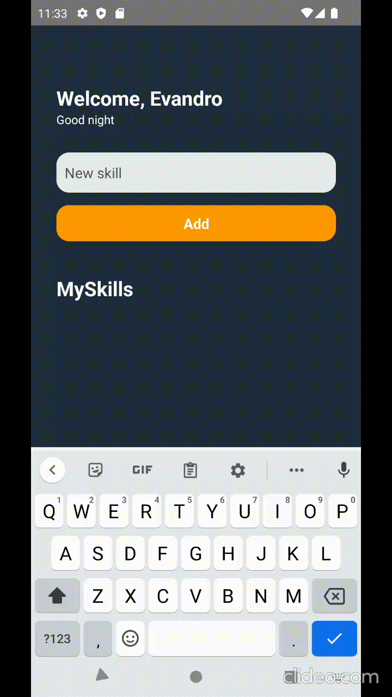
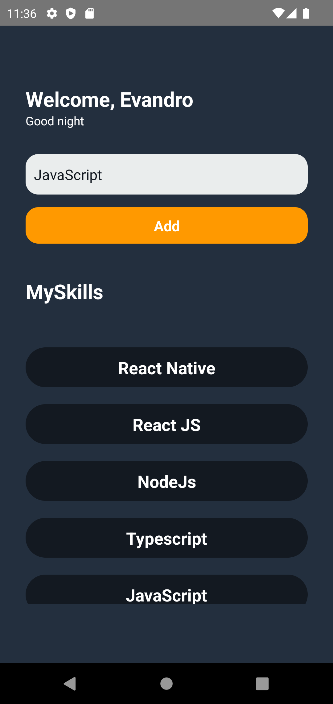

# 🚧 MySkills 🚧

<h4 align="center"> 
	🚀 A simple application to add Skills. Training the fundamentals in React Native.

</h4>

<p align="center">
  
</p>


## 💻 Sobre o projeto

  - Mini-Aplicativo mobile, desenvolvido para praticar aprendizados adquiridos no curso "IGNITE" da RocketSeat em React-Native;
  - Nele o usuário pode adicionar e remover habilidades;
  - O projeto inicialmente feito em JavaScript puro, e no decorrer da criação foi refatorado usando TypeScript;
  - Foram ultilizadas funções "Hooks" como useStates para controle e atualizações de estados da aplicação,
    assim como useEffect para rederizar componentes após atualização do mesmo;
  - Todos os componentes foram criados separadamente para serem reaproveitados caso necessário.


## 🎨 Layout

<p align="center">
   
</p>


<p align="center">
   
</p>
  


## 🛠 Tecnologias

As seguintes ferramentas foram usadas na construção do projeto:

- [React Native][rn]
- [JavaScript][javascript]
- [TypeScript][typescript]

## 🚀 Como executar o projeto

O projeto foi criando em "CLI" e com o gerenciador de pacotes "NPX".


💡é Preciso um emulador para executar o app, no meu caso usei "AndroidStudio", mas pode ser usando outros meios:

### Pré-requisitos

Antes de começar, você vai precisar ter instalado em sua máquina as seguintes ferramentas:
[Git](https://git-scm.com). 
Além disto é bom ter um editor para trabalhar com o código como [VSCode][vscode]

### 🎲 Rodando o App:

```bash
# Clone este repositório
$ git clone https://github.com/evandromsantana/MySkills

# Acesse a pasta do projeto no terminal/cmd
$ cd MySkills

# Instale as dependências
$ npx install

# Execute a aplicação:
$ npx react-native run-android

``` 


## 📝 Licença


<p>Made with 💜 by Evandro de Macêdo Santana</p>

<a  href="https://www.linkedin.com/in/evandro-m-santana" target="_blank"></a>


